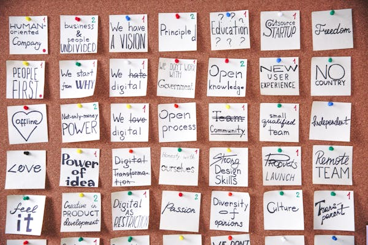

<!-- ============================================
     2章：ITの仕事（18〜22分）
     ============================================ -->

<!-- _class: dark -->

# 2

## ITの仕事
### エンジニアにも種類がある

<!--
- 章の導入
- エンジニアって一口に言っても色々ある
-->

---

# IT業界の全体像

  
企画

  
→

  
設計

  
→

  
開発

  
→

  
テスト

  
→

  
運用

  エンジニアは「開発」だけじゃない。全部に関わる

<!--
- IT業界の全体像を説明
- 企画→設計→開発→テスト→運用の流れ
- エンジニアは「開発」だけじゃなく、全工程に関わる
-->

---

# グループワーク

  <h2>「LINE」を作るなら？</h2>
  
どんな役割の人が必要だと思う？

<!--
- グループワークの導入
- LINEという身近なアプリを例に
- どんな人が必要か考えてもらう
-->

---

# まず1人で考えてみよう

  
3分間

  
思いついた役割をメモしてみて

  正解はないので、自由に考えてOK！

<!--
- 個人で考える時間を設ける
- 1分間、静かに考えてもらう
- メモを取ってもらう
- グループワークの前に自分の考えを持つ
-->

---

# 周りの人と話し合ってみよう

  
3分間

  
最低5つの役割を出してみよう

  「なぜ必要か」も一緒に考えてみて！

<!--
- 周りの人と話し合う時間
- 3分間で話し合い
- 正解はない、自由に考えてOK
- 発表してもらう予定
-->

---

# みんなが考えた役割

  
「何を作るか決める人」「デザインする人」「プログラムを書く人」...

  
そういう役割、<strong>実際に存在します</strong>

  それぞれの役割に名前がついている。

<!--
- 発表を受けて、実際の役割を紹介
- みんなが考えた役割は実在する
- これから具体的な職種名を紹介
-->

---

# プロダクトマネージャー（PM）

**何を作るか決める人**

- 「既読機能、つける？つけない？」
- 「スタンプは有料？無料？」
- 「次はどの機能を優先？」

  チームの方向性を決める「船長」のような存在

<!--
- PMは「何を作るか」を決める人
- 既読機能をつけるかどうか、スタンプの価格など
- チームの方向性を決める「船長」
- 技術だけでなくビジネス視点も必要
-->

---

# デザイナー

**どう見せるか決める人**

- トーク画面のレイアウトは？
- 吹き出しの色や形は？
- スタンプの大きさは？

  「見た目」だけじゃなく「使いやすさ」も考える

<!--
- デザイナーは「どう見せるか」を決める
- 見た目だけでなく「使いやすさ」も設計
- UX/UIデザインという分野
-->

---

# フロントエンド / モバイルエンジニア

**画面を作る人**

- **モバイル**: スマホアプリの画面
- **フロントエンド**: Webブラウザの画面

  みんながLINEを開いて見ている画面、この人たちが作ってる

<!--
- 画面を作るエンジニア
- モバイル: スマホアプリ（iOS/Android）
- フロントエンド: Webブラウザ
- みんなが触る部分を作っている
-->

---

# バックエンドエンジニア

**裏側の処理を作る人**

- 送信ボタン→メッセージが届く
- 相手が読んだら「既読」がつく
- 過去のトーク履歴を保存する

  目に見えないけど、一番重要な部分かもしれない

<!--
- 裏側の処理を作る人（自分の仕事に近い）
- 送信ボタン→メッセージ届く→既読がつく
- 目に見えないけど一番重要な部分
- データベースやAPIを設計・実装
-->

---

# インフラエンジニア

**土台を作る人**

- 何千万人が同時に使っても落ちない
- データを安全に保存する

  サーバーを管理して、サービスの土台を支える

<!--
- インフラは「土台を作る人」
- 何千万人が同時に使っても落ちない仕組み
- サーバーの管理、データの安全な保存
- 縁の下の力持ち
-->

---

# QAエンジニア

**品質を守る人**

- メッセージが届かない...
- 既読がつかない...
- アプリが突然落ちる...

  バグを見つけて報告する。安心して使えるのはこの人たちのおかげ

<!--
- QAは品質を守る人
- バグを見つけて報告する
- テストを設計・実行
- 安心して使えるのはこの人たちのおかげ
-->

---

# 実は、これはほんの一部

  <li>
    
📊

    

      <strong>データエンジニア</strong> 
      PMが判断するためのデータを集めて分析する
    

  </li>
  <li>
    
🤖

    

      <strong>機械学習エンジニア</strong> 
      「おすすめスタンプ」などAI機能を作る
    

  </li>
  <li>
    
🔧

    

      <strong>プラットフォームエンジニア</strong> 
      他のエンジニアが使う道具や環境を作る
    

  </li>

<!--
- 紹介したのはほんの一部
- データエンジニア: データを集めて分析
- 機械学習エンジニア: AI機能を作る
- プラットフォームエンジニア: 開発環境を作る
- 他にもたくさんある
-->

---

<h1 class="title-sm">作るものが変われば、必要な人も変わる</h1>

  

    <h3>ゲームを作るなら？</h3>
    <ul>
      <li>3Dエンジニア</li>
      <li>サウンドデザイナー</li>
      <li>ゲームプランナー</li>
    </ul>
  

  

    <h3>自動運転を作るなら？</h3>
    <ul>
      <li>画像認識エンジニア</li>
      <li>センサーエンジニア</li>
      <li>シミュレーションエンジニア</li>
    </ul>
  

  ITの仕事は本当にいろいろある

<!--
- 作るものによって必要な役割は変わる
- ゲーム: 3D、サウンド、ゲームプランナー
- 自動運転: 画像認識、センサー、シミュレーション
- ITの仕事は本当に多種多様
-->

---

# 2章のまとめ

  

    
1

    
1つのサービスを作るには、たくさんの役割が必要

  

  

    
2

    
今日紹介したのは代表的な例。実際はもっと多い

  

  

    
3

    
自分に合った役割が、きっとどこかにある

  

<!--
- 2章のまとめ
- 1つのサービスには多くの役割が必要
- 今日紹介したのは代表例、実際はもっと多い
- 自分に合った役割がきっとある
- プログラミングだけがエンジニアじゃない
-->

