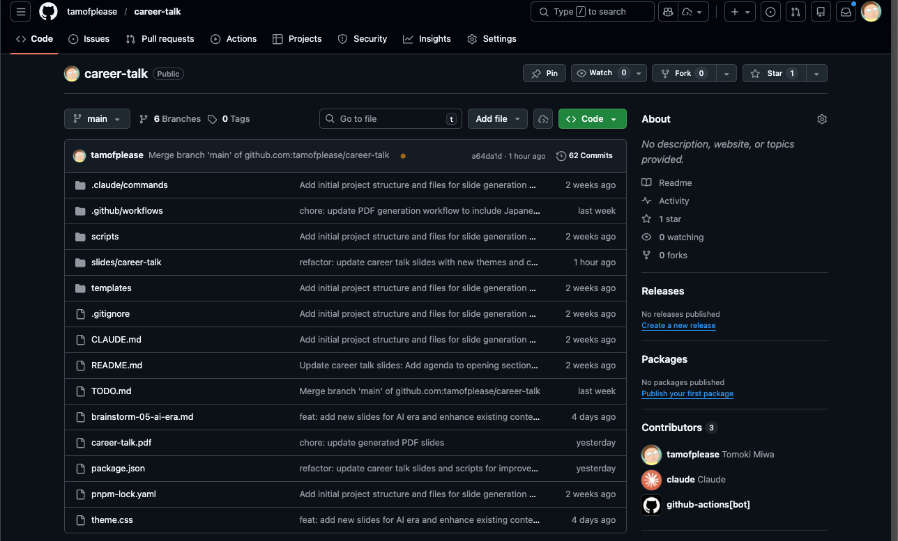

<!-- ============================================
     5章：AI時代のエンジニア
     ============================================ -->

<!-- _class: dark -->

# 5

## AI時代のエンジニア
### これからどうなる？（2026年1月時点）

  <h4>今日話すこと</h4>
  <ul>
    <li>いま何が起きている？</li>
    <li>エンジニアの価値はどう変わった？</li>
    <li>だから、なぜプログラミングを学ぶべき？</li>
  </ul>

---

# まず現実：AIはコードを書ける

  

    
💡

    
AIは<strong>「それっぽいコード」</strong>を高速に作れる

  

  

    
📦

    
<strong>画面の部品 / 定番の処理 / テスト</strong> など

  

  

    
🏢

    
現場でも<strong>普通に使われ始めている</strong>

  

  

    
🤔

    
だから「勉強いらない？」と思うのは<strong>自然</strong>

  

---

# でも重要：AIは"責任"を取れない

  AIが出したコードは…

  

    <h3>正しい？</h3>
    
仕様に合ってる？

  

  

    <h3>安全？</h3>
    
危ない穴はない？

  

  

    <h3>続けられる？</h3>
    
あとから直しやすい？

  

  <h3>✅ 現場で起きていること</h3>
  
「書く」より<strong>確認・判断</strong>の比重が増えた

---

# 価値が下がった能力

（以前ほど重要ではない）

  

    
🔍

    
<strong>調べてコピペする</strong> <small>AIに聞けば一発で答えが出る</small>

  

  

    
📖

    
<strong>細かいルールを暗記する</strong> <small>覚えなくてもAIが教えてくれる</small>

  

  

    
⚡

    
<strong>同じ作業を速くこなす</strong> <small>スピードではAIに勝てない</small>

  

  

    
📋

    
<strong>マニュアル通りに進める</strong> <small>決まった手順はAIが得意</small>

  

  ✅ まとめ：「調べる・覚える・繰り返す」はAIに任せる時代

---

# 変わらず必要な能力

（AIがいても消えない）

  

    
🎯

    
<strong>問題設定</strong>：そもそも何を作るべき？何が本当の課題？

  

  

    
🏗️

    
<strong>設計</strong>：LINEみたいなアプリ、AIに「作って」で完成する？

  

  

    
🐛

    
<strong>デバッグ</strong>：なぜ動かない？原因を突き止める力

  

  

    
✅

    
<strong>レビュー</strong>：このコードは正しい？危険な穴はない？

  

  

    
💬

    
<strong>説明</strong>：なぜこう作ったのか、チームに伝える力

  

  ✅ まとめ：エンジニアの仕事＝<strong>判断の連続</strong>

---

# 今まで以上に必要な能力

  

    
🤖

    
<strong>AIを使いこなす力</strong> <small>指示 → 検証 → 修正のサイクルを回す</small>

  

  

    
📝

    
<strong>AIに情報を伝える力</strong> <small>何をどう伝えれば望む結果が得られるか（言語化・文脈の共有）</small>

  

  

    
👁️

    
<strong>AIの出力を見極める判断力</strong> <small>出てきたコードや回答を鵜呑みにしない</small>

  

  

    
🚀

    
<strong>AI技術へのキャッチアップ力</strong> <small>新しいツールを学び、どこに活用できるか考える</small>

  

---

# 実は...このスライドもAIで作りました

  <h2>パワーポイントは使っていません</h2>

  

    
1

    
<strong>プロジェクトを作成させる</strong>：「スライド生成の仕組みを作って」

  

  

    
2

    
<strong>書きたい内容を伝える</strong>：「〇〇について説明するスライドを作って」

  

  

    
3

    
<strong>出力→修正の繰り返し</strong>：「ここをもう少しわかりやすく」

  

  自分で文字を打つのではなく<strong>AIへの指示だけ</strong>で作成しました

---

# 実際のプロジェクト画面

  

  このファイル全部、<strong>AIとの会話だけ</strong>で作りました

---

<!-- _class: dark -->

# 締めの一言

  
「AIがあるから勉強しなくていい」ではなく  
  <strong style="font-size: 1.3em;">「AIがあるからこそ、分かる人が強い」</strong>

